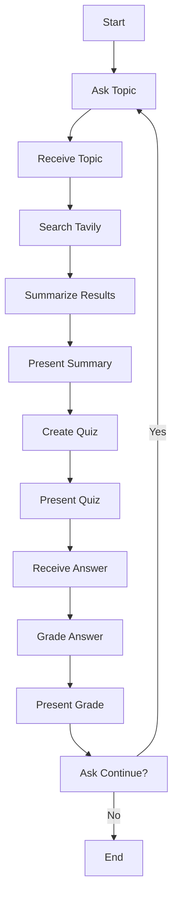

# 🏥 HealthBot - AI-Powered Patient Education System

An intelligent health education chatbot powered by **LangGraph**, **LangChain**, **OpenAI**, and **Tavily** that helps patients understand medical conditions through interactive learning and comprehension quizzes.

<div align="center">


</div>

---

## 📋 About the Project

HealthBot is an AI-powered educational system designed to improve patient understanding of medical conditions and health topics. It provides:

🔍 **Intelligent Search** - Retrieves reliable medical information from trusted sources using Tavily  
📄 **Smart Summarization** - Converts complex medical content into patient-friendly language  
📝 **Interactive Quizzes** - Tests comprehension with auto-generated questions  
🎯 **Instant Feedback** - Provides detailed evaluations with educational citations  
🔄 **Continuous Learning** - Allows exploring multiple topics in one session

---

## 🚀 Quick Start

### Prerequisites

- Python 3.13+
- OpenAI API key
- Tavily API key (for medical information search)

### Installation

1. **Clone the repository**
```bash
git clone <repository-url>
cd healthbot-project
```

2. **Create and activate virtual environment**
```bash
python -m venv .venv

# On Linux/Mac
source .venv/bin/activate

# On Windows
.venv\Scripts\activate
```

3. **Install dependencies**
```bash
pip install -e .
```

4. **Configure environment variables**
```bash
# Copy the example file
cp .env.example .env

# Edit .env and add your API keys
nano .env  # or use your preferred editor
```

Required keys in `.env`:
```bash
OPENAI_API_KEY=sk-proj-your-key-here
TAVILY_API_KEY=tvly-dev-your-key-here

# Optional: LangSmith for debugging
LANGCHAIN_TRACING_V2=true
LANGCHAIN_API_KEY=lsv2_pt_your-key-here
LANGCHAIN_PROJECT=HealthBot
```

5. **Run HealthBot**
```bash
python -m healthbot.main
```

---

## 💻 Usage

### Interactive Mode (Recommended)

Simply run the main application:

```bash
python -m healthbot.main
```

or

```bash
python src/healthbot/main.py
```

### Example Session

```
======================================================================
  🏥 HEALTHBOT - AI-Powered Patient Education System
======================================================================
  Version: 1.0.0 (MVP4 Complete)
  Powered by: LangGraph + LangChain + OpenAI + Tavily
======================================================================

🔧 Validating configuration...
✅ Configuration valid!

======================================================================
  STARTING INTERACTIVE SESSION
======================================================================

🚀 Starting conversation...

🤖 HealthBot:

Hello! I'm HealthBot, your health education assistant. 🏥

I'm here to help you better understand medical conditions and health care.

What health topic would you like to learn about today?
(Examples: diabetes, hypertension, asthma, anxiety)

👤 Enter a health topic you'd like to learn about:
   > diabetes

[Bot searches, summarizes, and presents educational content]

👤 Enter your answer (A, B, C, or D):
   > B

[Bot evaluates and provides feedback]

👤 Would you like to learn about another topic? (yes/no):
   > yes

[Loop continues or session ends]
```

---

## 🏗️ Architecture

### Project Structure

```
healthbot-project/
├── .env                    # Environment variables (DO NOT COMMIT!)
├── .env.example            # Example environment file
├── .gitignore              # Git ignore rules
├── pyproject.toml          # Project configuration
├── requirements.txt        # Python dependencies
├── README.md               # This file
│
└── src/
    └── healthbot/
        ├── __init__.py     # Package initialization
        ├── main.py         # Main application entry point
        ├── settings.py     # Configuration and API key validation
        ├── state.py        # Graph state definition (TypedDict)
        └── graph.py        # LangGraph workflow and nodes
```

### Conversation Flow



### Key Components

#### 1. **State Management** (`state.py`)
- TypedDict-based state for type safety
- Tracks conversation history, topic, search results, quiz data
- Automatic message accumulation with LangGraph

#### 2. **Configuration** (`settings.py`)
- Pydantic-based settings validation
- Automatic `.env` file loading
- API key validation and environment setup

#### 3. **Workflow Orchestration** (`graph.py`)
- **12 specialized nodes**:
  - `ask_topic` - Initiates conversation
  - `receive_topic` - Captures user's topic
  - `search_tavily` - Searches medical information
  - `summarize` - Creates patient-friendly summary
  - `present_summary` - Displays educational content
  - `create_quiz` - Generates comprehension question
  - `present_quiz` - Shows quiz to user
  - `receive_answer` - Captures quiz response
  - `grade_answer` - Evaluates with LLM
  - `present_grade` - Shows evaluation results
  - `ask_continue` - Prompts for continuation
  - `receive_continue` - Handles loop decision

- **Human-in-the-loop**: Pauses for user input at strategic points
- **Conditional routing**: Decides between new topic or session end
- **State persistence**: Uses MemorySaver for conversation continuity

#### 4. **Main Application** (`main.py`)
- Interactive console interface
- Input validation and error handling
- Session management
- User-friendly message formatting

---

## 🛠️ Technologies Used

| Technology | Version | Purpose |
|-----------|---------|---------|
| **Python** | 3.13+ | Core programming language |
| **LangChain** | 0.2.16+ | LLM framework and integrations |
| **LangGraph** | 0.2.19+ | Stateful workflow orchestration |
| **OpenAI** | via langchain-openai | GPT-4o-mini for summarization and quizzes |
| **Tavily** | 0.4.0+ | Medical information search engine |
| **Pydantic** | 2.7+ | Data validation and settings |
| **python-dotenv** | 1.0.1+ | Environment variable management |

---

## 🎯 Features

### ✅ Implemented

- [x] Interactive health topic selection
- [x] Intelligent search using Tavily (medical sources focus)
- [x] LLM-powered summarization in accessible language
- [x] Automatic quiz generation based on content
- [x] AI-powered answer evaluation with scoring
- [x] Educational feedback with summary citations
- [x] Continuous learning loop (multiple topics per session)
- [x] Human-in-the-loop for user control
- [x] Stateful conversation with persistence
- [x] Graceful error handling

### 🎓 Educational Goals

1. **Improve patient understanding** of medical conditions
2. **Provide 24/7 access** to reliable health information
3. **Reduce workload** on healthcare providers
4. **Increase patient engagement** in their healthcare
5. **Support better treatment adherence** through education

---

## 🧪 Testing

The application includes comprehensive validation:

```bash
# Validate configuration
python -c "from healthbot.settings import settings; print(settings.validate_required_keys())"

# Test complete flow
python -m healthbot.main
```

---

## 📦 Development

### Code Quality Tools

```bash
# Format code
ruff format .

# Check linting
ruff check .

# Auto-fix issues
ruff check . --fix

# Type checking (if using pyright)
pyright
```

### Project Configuration

See `pyproject.toml` for:
- Dependency management
- Ruff linting rules
- Code formatting standards
- Type checking configuration

---

## 🔒 Security Notes

- ⚠️ **Never commit `.env` file** to version control
- ✅ Use `.env.example` for sharing configuration templates
- 🔑 Keep API keys secure and rotate them regularly
- 📝 `.gitignore` is configured to exclude sensitive files

---

## 📄 License

This is an educational project developed as part of the Udacity LangGraph/LangChain course.

---

## 👤 Author

**Fabio Lima**  
📧 Email: lima.fisico@gmail.com  
🐙 GitHub: [@FabioCLima](https://github.com/FabioCLima)

---

## 🙏 Acknowledgments

- **Udacity** - LangGraph/LangChain course
- **LangChain** - Framework and excellent documentation
- **OpenAI** - GPT models for intelligent content generation
- **Tavily** - Reliable medical information search
- **Anthropic** - Claude for development assistance

---

## 📞 Support

If you encounter any issues:

1. Check that all API keys are correctly configured in `.env`
2. Verify Python version is 3.13+
3. Ensure all dependencies are installed: `pip install -e .`
4. Review error messages for configuration problems

For questions about LangGraph/LangChain concepts, refer to:
- [LangChain Documentation](https://python.langchain.com/)
- [LangGraph Documentation](https://langchain-ai.github.io/langgraph/)

---

<div align="center">

**Built with ❤️ for better patient education**

Last Updated: October 2025

</div>